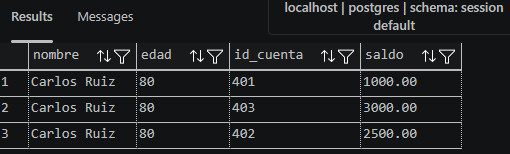
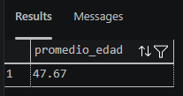
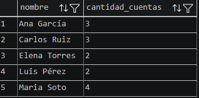
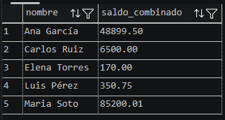
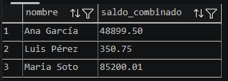

# Actividad SQL - Llaves, DDL/DML y Consultas de Agregación

## Q3 - Saldo de cada cuenta del cliente con más edad

El cliente de mayor edad es Carlos Ruiz (80 años). Se usa una subconsulta con MAX(edad) para identificarlo y se listan todas sus cuentas con nombre, edad, id y saldo.

---

## Q4 - Promedio de edad de clientes con saldo negativo

Los clientes con al menos una cuenta negativa son Ana (78), Luis (25) y Maria (40). El promedio resulta en 47.67.

---

## Q5 - Nombre y cantidad de cuentas de quienes tienen más de una

Se agrupa por cliente y se filtra con HAVING COUNT > 1. Con los datos ingresados, los 5 clientes califican (entre 2 y 4 cuentas cada uno).

---

## Q6 - Saldo combinado por cliente con más de una cuenta

Mismo agrupamiento que Q5 pero sumando los saldos. El resultado incluye cuentas positivas y negativas de cada cliente.

---

## Q7 - Clientes con al menos una cuenta negativa y su saldo combinado total

Solo aparecen Ana, Luis y Maria por tener al menos una cuenta negativa. El saldo combinado considera todas sus cuentas, no solo las negativas.

